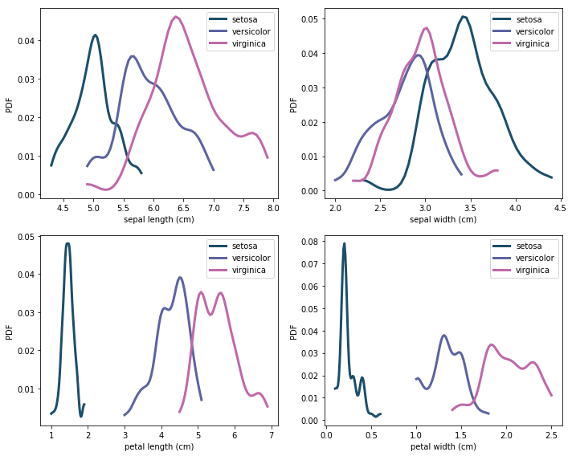
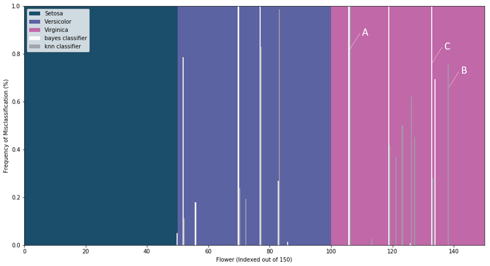
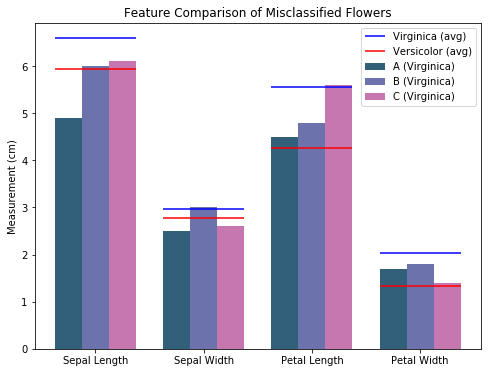

# Comparison of Item Misclassification with Naive Bayesian and k-Nearest Neighbors Classifiers 

### Sabrina Pereira and Ashley Swanson

## Introduction

There are a wide variety of methods and computational tools available for purposes of classification. To ensure that the correct tool is picked for the problem, it is important to know - does choosing a specific classifier over another matter? Will there be differences in the items that they misclassify?

If different classifiers misclassify the same items, it is very likely that the misclassification of the items is due to the ambiguity of the item’s specific data. However, if the classifiers are misclassifying different items, it means that the misclassifications are heavily impacted by the structure of the classifier itself. In this case, there may be cause to look into combining classifiers to produce improved classification outcomes.

To explore this question, we look at the differences between the classification outcomes of a [k-nearest neighbors](https://scikit-learn.org/stable/modules/naive_bayes.html) classifier and a [naive Bayesian](https://scikit-learn.org/stable/modules/neighbors.html#classification) classifier trained on the same dataset to comparable accuracies and contrast the subsets of data that each misclassified. 

## Data Description and Exploration

We decided to use the iris dataset provided in scikit-learn, one of the most widely used datasets for classification. It was originally collected by Edgar Anderson in 1935, and used in R. A. Fisher’s paper [The Use of Multiple Measurements in Taxonomic Problems](http://rcs.chemometrics.ru/Tutorials/classification/Fisher.pdf). 

For 150 flowers that are categorized as one of three types of irises (setosa, versicolor, and virginica), Anderson recorded four key physical features (sepal length, sepal width, petal length, petal width).

Here, the distribution of sizes for each feature and iris types are plotted. This allows for comparison between distributions, and it gives us some sense of what the decision boundaries might be like for our classifiers - for example, if a flower has a petal width under .5cm, we imagine that our classifiers would take that information and classify it as a setosa iris. 

From this figure, we can see that some features are more valuable for distinguishing between iris types than other features. For example, the distribution of petal widths for setosa irises does not overlap with the petal width distributions of the other irises. This means that, by only looking at the petal width of a flower, it is easy to tell if that flower is a setosa iris. However, there is no plot where the distribution of measurements for versicolor and virginica do not overlap, indicating that a flower with a feature that is typical of both iris types could be misclassified. The power of our classifiers lies in their ability to make modeling decisions to consider more than one feature, increasing the likelihood of correct outcomes. 

## Classification Methodology

We used the principle of cross-validation to understand how well our classifiers were operating, splitting the dataset into two sets 1000 times and training each classifier on the training subsets. From the corresponding test sets, we calculated the accuracy score for each test-train split and found the average accuracy score. We then used this information to ensure that both our naive Bayesian and k-nearest neighbors classifiers classified at a comparable level, tuning the hyperparameter such that it would yield an average accuracy score comparable to the naive Bayesian classifier of approximately 95%. This acted as a control method as we aim to compare the characteristics of the misclassified data rather than the accuracy levels of the classifiers. 

For each iteration where we trained and tested the classifiers with a random test-train split, we recorded which of the flowers in the test set were misclassified. We then evaluated commonly misclassified flowers to see which classifier tended to produce the incorrect classification or if both misclassified that flower. 

For more information, please visit the [jupyter notebook](https://github.com/ASHSWAN1999/Bayes-vs-Machine-Learning-Comparison) containing our analysis.

## Results

To see if the classifiers differed in what they misclassify, we observed which iris types were misclassified most often and what they were misclassified as for the Bayesian and k-NN models. We also observed which specific flowers were misclassified most often, and how these differ for each classifier.

### Misclassifications by Iris Type

Over 1000 iterations, the classifiers produced a 5% average misclassification rate. From these, we computed the breakdowns of the misclassified iris types for each classifier. Neither classifier appeared to have any difficulty correctly classifying flowers as setosa irises.

For the naive Bayesian classifier, 46.6% of the misclassified were versicolor irises classified as virginica, and 53.4% were virginica irises classified as versicolor, classifying the versicolor and virginica flowers incorrectly as each other about half of the time. We hypothesize that this even split occurred because the Bayesian algorithm is sheerly probabilistic, so, for flowers that landed in the gray zone between versicolor and virginica, there was roughly a 50/50 chance of classifying them one way or the other. 

For the k-NN classifier, 34.2% of the misclassified flowers were versicolor irises classified as virginica, and 65.8% were virginica irises classified as versicolor, misclassifying the virginica flowers as versicolor about twice as often as the other way around. This deviation from an even split demonstrates a core difference between the models - that in its current states, the k-NN classifier favors classifying flowers as versicolor.

### Misclassifications of Individual Flowers

Below is the frequency of misclassification for each flower in the dataset under both classifiers. The x-axis represents each of the 150 flowers measured in this dataset. The background colors show the true iris type of each of these flowers, and the bars show what percentage of the time a given flower was misclassified by each classifier. 

We can see that there are three categories of flowers: those that were commonly misclassified by both models, those that were often misclassified by one model and not the other, and those that were sometimes misclassified with any classifier. The first case suggests that these flowers were truly ambiguous, possibly exhibiting common characteristics of another iris type. The second case where only one model misclassifies a flower consistently suggests flaws within that model itself - its decision boundaries led to a misclassification that another model got correct. The final case of the presence of flowers that are sometimes misclassified by either model suggests that they could be classified more reliably with the addition of more data, as the accuracy is dependant on the test-train split. 

We observed a specific flower from the dataset that was misclassified by both classifiers 100% of the time (further referenced as flower A, a virginica iris), one that was frequently (76%) misclassified by k-nearest neighbors but not the Bayesian model (flower B, virginica iris), and another that was frequently (69%) misclassified by the Bayesian classifier but not the k-nearest neighbors model (flower C, virginica iris). 

Below are the measurements for flowers A, B, and C, which were all were all virginica irises frequently incorrectly classified as versicolor. Overlaid are the average measurements of versicolor irises (denoted by the red lines) and virginica irises (denoted by the blue lines).

Looking at these traits, we see that the measurements for flower A are not in line with what we would expect from the average virginica iris - most humans would probably guess that it’s a versicolor iris as well! Flowers B and C are not as easily classifiable as one or the other by a human, especially when we remember that some features are more indicative of an iris type than others. The fact that these flowers differ in measurements by a relatively large amount, and were only misclassified by one classifier, evidences the idea that even with the same dataset and accuracy, the decision boundaries created by each classifier will vary and produce different results.

## Conclusion 

Although this is a low stakes example, under other circumstances, misclassified item types and their incorrect classifications could have real-world consequences, and these metrics could direct you to which classifier best fits your needs. 

This exploration suggests that a combination of classifiers could counteract each other’s deficits, although it is important to note that only the items that are reliably classified in one classifier (such as flower B and flower C) should be reliably classified in the new combination. 

